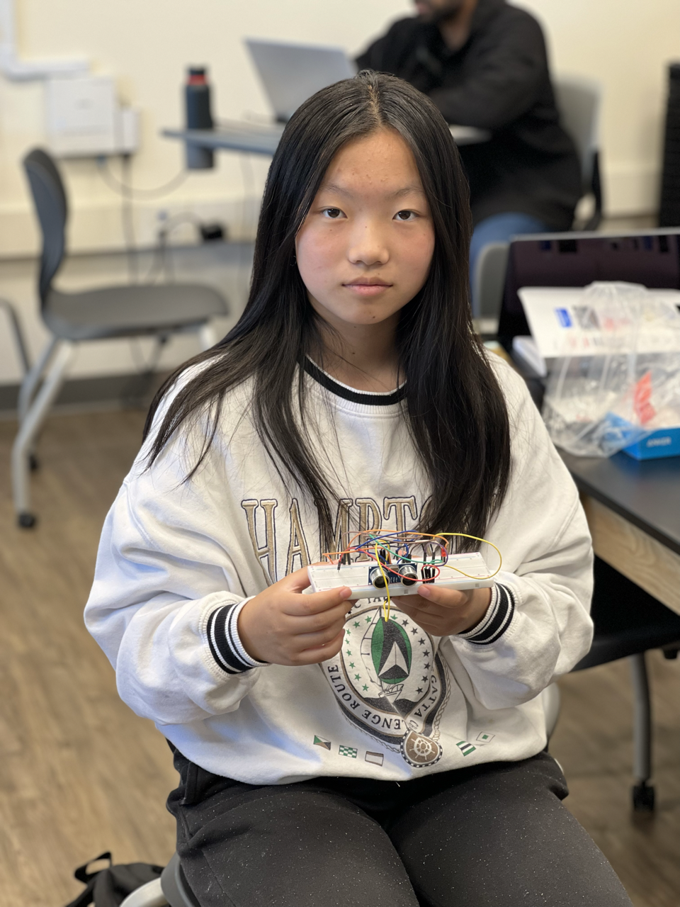
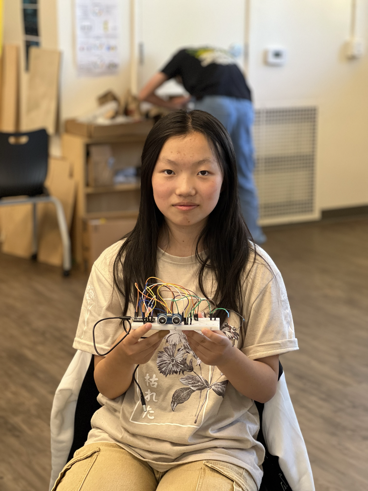

# Third Eye For The Blind
This project is a device for blind people, which uses an ultrasonic sensor to sense if an object is close, and then alerts the user using a buzzer and a vibrating motor. The closer the object is to the sensor, the faster the buzzer will buzz, or the faster the motor will vibrate. The user is able to choose between using the buzzer and the motor by using voice control. 

| **Engineer** | **School** | **Area of Interest** | **Grade** |
|:--:|:--:|:--:|:--:|
| Tiffany Z | Valley Christian | Biomedical Engineering | Incoming Sophomore

<!--- **Replace the BlueStamp logo below with an image of yourself and your completed project. Follow the guide [here](https://tomcam.github.io/least-github-pages/adding-images-github-pages-site.html) if you need help.** -->

 

  
# Final Milestone

<!--- **Don't forget to replace the text below with the embedding for your milestone video. Go to Youtube, click Share -> Embed, and copy and paste the code to replace what's below.** -->
<iframe width="560" height="315" src="https://www.youtube.com/embed/B0V6-hfV44w" title="YouTube video player" frameborder="0" allow="accelerometer; autoplay; clipboard-write; encrypted-media; gyroscope; picture-in-picture; web-share" allowfullscreen></iframe>

## Summary:

For my final milestone, I was able to get the voice control to toggle between the buzzer and the vibrating motor. This works with the ultrasonic sensor, so that when an object is within 20cm, the buzzer starts buzzing, and when the command word is spoken, it switches to the motor. 

### Components Used:

- vibrating DC motor
- piezo buzzer
- Arduino Nano 33 BLE Sense, because it has a microphone built in


The way this works is that I used machine learning to make my model recognize the command word, "switch", and then I used a flag, which is a variable, similar to a boolean, that is given a value, either 1 or 0, based on conditions met. I set the default flag to 0. I made it so that when the command word was recognized, the flag would switch to 1, and if it already 1 when my command word was spoken, it would switch back to 0. I also wrote a line of code that stated that if flag was equal to 0, the buzzer would buzz if an object was within a certain distance, and if flag was equal to 1, the motor would vibrate if an object was in said distance instead. 

## Progress: 

My previous milestone was simply getting the voice control to recognize my voice and work by blinking an LED. From that, I was able to get the voice control to toggle between the motor and the buzzer, which is a big step up from simply blinking an LED. 


## Challenges:

I faced many challenges during this. For one, I had formatted my code wrong, meaning that my flag would not switch when my command word was spoken. I also ran into the problem of my buzzer and motor not getting enough power, as they operated on 5 volts while my Arduino was 3.3 volts. I solved this problem by using a transistor that connected to the one 5 volt pin on the Arduino, so that the buzzer and motor could get 5 volts instead of 3.3. 


# Second Milestone

<!--- **Don't forget to replace the text below with the embedding for your milestone video. Go to Youtube, click Share -> Embed, and copy and paste the code to replace what's below.** -->
<iframe width="560" height="315" src="https://www.youtube.com/embed/PZml6ZQux0A" title="YouTube video player" frameborder="0" allow="accelerometer; autoplay; clipboard-write; encrypted-media; gyroscope; picture-in-picture; web-share" allowfullscreen></iframe>

## Summary:

For my second milestone, I decided to add voice control to my project to toggle between the motor and the buzzer rather than using a switch. The reasoning for this was that voice control would be much more convenient for a blind person rather than flipping a switch. The actual second milestone, however, was simply getting the voice control to work. To make sure it worked, I made the Arduino blink the built-in LED when my command, the word "switch", was spoken. 

### Components Used:

- an Arduino board (specifically the 33 BLE Sense, as that has a built-in microphone)

The way I got the voice-control to work was by using a machine learning model. Machine learning works by giving the model a bunch of training data, and it learns based on that "experience". In my case, I recorded myself and some friends saying the command word, as well as getting some samples of background noise online. I then curated the data so that it sorted it into background noise and the command word. I then trained the curated data and tested it using Edge Impulse.

## Progress:

I previously only had a working prototype with a physical switch, so from that I had added a lot to my project. Although using voice control as a switch may seem like sort of a small modification, the process for this was very long and pretty difficult as well, and it took well over a week just for the voice control to work enough to blink an LED. 

## Challenges: 

A challenge I faced was that my original command, "Arduino, switch", was too long and would not be accepted, as the script I was using would only accept one second samples. I had already collected samples and did not want to do it all again, so I settled on cutting all of my samples to only being the word "switch". My next step, which is my third milestone, is to get the voice control to work with the buzzer and the motor. 

## Next Steps:

My next step is to get my voice control to be able to actually toggle between my motor and my buzzer. 

# First Milestone

<!--- **Don't forget to replace the text below with the embedding for your milestone video. Go to Youtube, click Share -> Embed, and copy and paste the code to replace what's below.** -->

<iframe width="560" height="315" src="https://www.youtube.com/embed/yANam3uWhAs" title="YouTube video player" frameborder="0" allow="accelerometer; autoplay; clipboard-write; encrypted-media; gyroscope; picture-in-picture; web-share" allowfullscreen></iframe>

## Summary:

For my first milestone, I put together a working prototype of my intensive project. It uses an ultrasonic sensor to determine how far an object is away. If the object is 50 centimeters or closer, the LED will start flashing, and the buzzer will start beeping. The closer the object is to the sensor in that range, the faster the buzzer will beep and the faster the LED will flash. I also added a switch which can toggle between the buzzer and a vibrating motor. The motor will act the same as the buzzer, where it will vibrate if an object is 50 centimeters or closer to the ultrasonic sensor and will vibrate faster the closer the object is.

### Components Used:
- a breadboard - a base to attach all the components to, and is connected on the bottom using metal, making it solderless
- an LED - flashes when object is within range
- a toggle switch - used to switch between the buzzer and vibrating motor
- Arduino board - the CPU of this unit, runs the code that I give it and has pins that connects to the rest of the components
- vibrating motor - vibrates when object is within range (can switch with buzzer by flipping the toggle switch)
- buzzer - makes a beeping nose when object is within range (can switch with vibrating motor by flipping toggle switch)
- ultrasonic sensor - senses the object and how far away it is
- jumper wires - used to connect the circuit together

The ultrasonic sensor works by emitting high-frequency sound waves using the trig pin. When the sound hits an object, it bounces back and is received by the echo pin. By seeing how long it takes for sound to bounce back, a certain distance is given to the object. The code uses an “if” conditional statement to state that if an object is within 50 centimeters of the sensor, the LED will start flashing and the buzzer will start beeping. I ran into some challenges when building the prototype. 

## Challenges:

I ran into some challenges when building the prototype. For one, I had initially wired it incorrectly, resulting in my project not working. I also did not know the meaning of the code given in the tutorial beforehand, meaning that if I ran into any issues with software, I wouldn't know what to do, so I spent a decent amount of time researching the functions that showed up in the code. My next step would be to add modifications to my prototype. 

## Next Steps: 

My next step is to work on my modificiations. My modification is to add voice control in place of a toggle switch. 

# Starter Project

<iframe width="560" height="315" src="https://www.youtube.com/embed/Fm-Xq8GF3oU" title="YouTube video player" frameborder="0" allow="accelerometer; autoplay; clipboard-write; encrypted-media; gyroscope; picture-in-picture; web-share" allowfullscreen></iframe>

## Summary:

For my starter project I put together an RBG LED. The RBG LED is able to light up red, green, or blue, and each switch controls a different color.

### Components Used: 

- a circuitboard - connects LED to power source and switches
- RBG LED - a color changing LED that consists of internal LEDs that produce red, green, and blue
- three slide potentiometers - controls the intensity of the output color based on the position of the current on the resistor
- solder & soldering iron

The electrical current runs along a resistor, and the position of the potentiometer controls how far along the resistor the current runs, and thus how much resistance there is on the current and how intense the output color is. The more resistance on the current, the less intense the output color and vice versa. Each potentiometer is connected to a single internal LED, changing the intensity of that specific color. If two of the switches are turned on together, the output color will be a color that is a mix of the two colors those switches control. 

## Challenges:

I did not know how to solder prior to this project, so I had to learn how to do that in order to build this.

## Next Steps:

My next step is to start on my intensive project, which is the Third Eye For The Blind. 

<!--- # Schematics 
Here's where you'll put images of your schematics. [Tinkercad](https://www.tinkercad.com/blog/official-guide-to-tinkercad-circuits) and [Fritzing](https://fritzing.org/learning/) are both great resoruces to create professional schematic diagrams, though BSE recommends Tinkercad becuase it can be done easily and for free in the browser. -->

# Code
Here's where you'll put your code. The syntax below places it into a block of code. Follow the guide [here]([url](https://www.markdownguide.org/extended-syntax/)) to learn how to customize it to your project needs.

```c++
#define EIDSP_QUANTIZE_FILTERBANK   0
#define EI_CLASSIFIER_SLICES_PER_MODEL_WINDOW 2
#include <PDM.h>
#include <speech-recognition_inferencing.h>
typedef struct {
    signed short *buffers[2];
    unsigned char buf_select;
    unsigned char buf_ready;
    unsigned int buf_count;
    unsigned int n_samples;
} inference_t;

static inference_t inference;
static bool record_ready = false;
static signed short *sampleBuffer;
static bool debug_nn = false; // Set this to true to see e.g. features generated from the raw signal
static int print_results = -(EI_CLASSIFIER_SLICES_PER_MODEL_WINDOW);

#define pingTrigPin 12
#define pingEchoPin 10
int flag = 0;
#define buzzPin 5
#define motorPin 6

/**
 * @brief      Arduino setup function
 */
void setup() {
 pinMode (buzzPin, OUTPUT);
    pinMode (motorPin, OUTPUT);
    Serial.begin(115200);
    while (!Serial);
    Serial.println("Edge Impulse Inferencing Demo");
    ei_printf("Inferencing settings:\n");
    ei_printf("\tInterval: %.2f ms.\n", (float)EI_CLASSIFIER_INTERVAL_MS);
    ei_printf("\tFrame size: %d\n", EI_CLASSIFIER_DSP_INPUT_FRAME_SIZE);
    ei_printf("\tSample length: %d ms.\n", EI_CLASSIFIER_RAW_SAMPLE_COUNT / 16);
    ei_printf("\tNo. of classes: %d\n", sizeof(ei_classifier_inferencing_categories) /
                                            sizeof(ei_classifier_inferencing_categories[0]));

    run_classifier_init();
    if (microphone_inference_start(EI_CLASSIFIER_SLICE_SIZE) == false) {
        ei_printf("ERR: Could not allocate audio buffer (size %d), this could be due to the window length of your model\r\n", EI_CLASSIFIER_RAW_SAMPLE_COUNT);
        return;
    }
}

void loop() {
  // put your main code here, to run repeatedly:
 bool m = microphone_inference_record();
    if (!m) {
        ei_printf("ERR: Failed to record audio...\n");
        return;
    }

    signal_t signal;
    signal.total_length = EI_CLASSIFIER_SLICE_SIZE;
    signal.get_data = &microphone_audio_signal_get_data;
    ei_impulse_result_t result = {0};

    EI_IMPULSE_ERROR r = run_classifier_continuous(&signal, &result, debug_nn);
    if (r != EI_IMPULSE_OK) {
        ei_printf("ERR: Failed to run classifier (%d)\n", r);
        return;
    }
    if (result.classification[1].value > 0.8) 
    {
      Serial.println ("SWITCH");
      if (flag == 0)
      {
        flag = 1;
      }
      else {
        flag = 0;
      }
    }

    if (++print_results >= (EI_CLASSIFIER_SLICES_PER_MODEL_WINDOW)) {
        // print the predictions
        ei_printf("Predictions ");
        ei_printf("(DSP: %d ms., Classification: %d ms., Anomaly: %d ms.)",
            result.timing.dsp, result.timing.classification, result.timing.anomaly);
        ei_printf(": \n");
        for (size_t ix = 0; ix < EI_CLASSIFIER_LABEL_COUNT; ix++) {
            ei_printf("    %s: %.5f\n", result.classification[ix].label,
                      result.classification[ix].value);
        }
#if EI_CLASSIFIER_HAS_ANOMALY == 1
        ei_printf("    anomaly score: %.3f\n", result.anomaly);
#endif

        print_results = 0;
    }
  
  long duration, cm;   
  pinMode(pingTrigPin, OUTPUT);   
  digitalWrite(pingTrigPin, LOW);   
  delayMicroseconds(2);   
  digitalWrite(pingTrigPin, HIGH);   
  delayMicroseconds(5);   
  digitalWrite(pingTrigPin, LOW);   
  pinMode(pingEchoPin, INPUT);   
  duration = pulseIn(pingEchoPin, HIGH);   
  cm = duration / 29 / 2;
  
  if (flag == 0)
  {
  if(cm<=20 && cm>0)   
  {
  int d= map(cm, 1, 100, 20, 2000);   
  digitalWrite(buzzPin, HIGH);   
  delay(100);   
  digitalWrite(buzzPin, LOW);   
  delay(d);
  Serial.print (cm);
  Serial.print ("cm");
  Serial.println ();
  }  
  } else 
  {
    if (cm<=20 && cm>0)
    {
    int d= map(cm, 1, 100, 20, 2000);   
    digitalWrite(motorPin, HIGH);   
    delay(100);   
    digitalWrite(motorPin, LOW);   
    delay(d);
    Serial.print (cm);
    Serial.print ("cm");
    Serial.println ();
    }
  }
  Serial.print ("flag: ");
  Serial.print (flag);
  Serial.println();
}
/**
 * @brief      PDM buffer full callback
 *             Get data and call audio thread callback
 */
static void pdm_data_ready_inference_callback(void)
{
    int bytesAvailable = PDM.available();

    // read into the sample buffer
    int bytesRead = PDM.read((char *)&sampleBuffer[0], bytesAvailable);

    if (record_ready == true) {
        for (int i = 0; i<bytesRead>> 1; i++) {
            inference.buffers[inference.buf_select][inference.buf_count++] = sampleBuffer[i];

            if (inference.buf_count >= inference.n_samples) {
                inference.buf_select ^= 1;
                inference.buf_count = 0;
                inference.buf_ready = 1;
            }
        }
    }
}

/**
 * @brief      Init inferencing struct and setup/start PDM
 *
 * @param[in]  n_samples  The n samples
 *
 * @return     { description_of_the_return_value }
 */
static bool microphone_inference_start(uint32_t n_samples)
{
    inference.buffers[0] = (signed short *)malloc(n_samples * sizeof(signed short));

    if (inference.buffers[0] == NULL) {
        return false;
    }

    inference.buffers[1] = (signed short *)malloc(n_samples * sizeof(signed short));

    if (inference.buffers[1] == NULL) {
        free(inference.buffers[0]);
        return false;
    }

    sampleBuffer = (signed short *)malloc((n_samples >> 1) * sizeof(signed short));

    if (sampleBuffer == NULL) {
        free(inference.buffers[0]);
        free(inference.buffers[1]);
        return false;
    }

    inference.buf_select = 0;
    inference.buf_count = 0;
    inference.n_samples = n_samples;
    inference.buf_ready = 0;

    // configure the data receive callback
    PDM.onReceive(&pdm_data_ready_inference_callback);

    PDM.setBufferSize((n_samples >> 1) * sizeof(int16_t));

    // initialize PDM with:
    // - one channel (mono mode)
    // - a 16 kHz sample rate
    if (!PDM.begin(1, EI_CLASSIFIER_FREQUENCY)) {
        ei_printf("Failed to start PDM!");
    }

    // set the gain, defaults to 20
    PDM.setGain(127);

    record_ready = true;

    return true;
}

/**
 * @brief      Wait on new data
 *
 * @return     True when finished
 */
static bool microphone_inference_record(void)
{
    bool ret = true;

    if (inference.buf_ready == 1) {
        ei_printf(
            "Error sample buffer overrun. Decrease the number of slices per model window "
            "(EI_CLASSIFIER_SLICES_PER_MODEL_WINDOW)\n");
        ret = false;
    }

    while (inference.buf_ready == 0) {
        delay(1);
    }

    inference.buf_ready = 0;

    return ret;
}

/**
 * Get raw audio signal data
 */
static int microphone_audio_signal_get_data(size_t offset, size_t length, float *out_ptr)
{
    numpy::int16_to_float(&inference.buffers[inference.buf_select ^ 1][offset], out_ptr, length);

    return 0;
}

/**
 * @brief      Stop PDM and release buffers
 */
static void microphone_inference_end(void)
{
    PDM.end();
    free(inference.buffers[0]);
    free(inference.buffers[1]);
    free(sampleBuffer);
}

#if !defined(EI_CLASSIFIER_SENSOR) || EI_CLASSIFIER_SENSOR != EI_CLASSIFIER_SENSOR_MICROPHONE
#error "Invalid model for current sensor."
#endif

```

# Bill of Materials
Here's where you'll list the parts in your project. To add more rows, just copy and paste the example rows below.
Don't forget to place the link of where to buy each component inside the quotation marks in the corresponding row after href =. Follow the guide [here]([url](https://www.markdownguide.org/extended-syntax/)) to learn how to customize this to your project needs.

| **Part** | **Note** | **Price** | **Link** |
|:--:|:--:|:--:|:--:|
| Vibrating motor | Alerts the user of a close object using vibration | $17.99 | <a href="https://www.amazon.com/BestTong-8000RPM-12000RPM-Vibration-Vibrating-Coreless/dp/B07CVKHHJV/ref=sr_1_2_sspa?crid=27TAWWDS29U87&keywords=vibrating+motor&qid=1684442516&s=electronics&sprefix=vibrating+moto%2Celectronics%2C107&sr=1-2-spons&psc=1&spLa=ZW5jcnlwdGVkUXVhbGlmaWVyPUExVkdDR0Q2QTk0VUhMJmVuY3J5cHRlZElkPUEwNzY2NDMyMTRENlU5SFJHVzVTTSZlbmNyeXB0ZWRBZElkPUEwNjU0MDYwTDhYNjQ1UDhFWUMyJndpZGdldE5hbWU9c3BfYXRmJmFjdGlvbj1jbGlja1JlZGlyZWN0JmRvTm90TG9nQ2xpY2s9dHJ1ZQ=="> Link </a>|
| Arduino Nano | Microcontroller, processes code and powers everything| $17.40 | <a href="https://www.amazon.com/Arduino-Nano-Every-headers-Mounted/dp/B07WWK29XF/ref=sr_1_14?crid=3RU6JDFYIVO7A&keywords=arduino+nano&qid=1680888917&sprefix=arduino+nan%2Caps%2C178&sr=8-14"> Link </a> |
| Buzzer | Alerts the user of a close object by buzzing | $8.99 | <a href="https://www.amazon.com/Xiaoyztan-Electronic-2-Terminal-Loudspeakers-Applicances/dp/B07GBTJP9F/ref=cm_cr_arp_d_product_top?ie=UTF8"> Link </a> |
| Ultrasonic Sensor | Senses the object and how close it is | $10.99 | <a href="https://www.amazon.com/WMYCONGCONG-HC-SR04-Ultrasonic-Distance-Measuring/dp/B07JJHCVRG/ref=asc_df_B07JJHCVRG/?tag=hyprod-20&linkCode=df0&hvadid=312172614854&hvpos=&hvnetw=g&hvrand=14791508169259773733&hvpone=&hvptwo=&hvqmt=&hvdev=c&hvdvcmdl=&hvlocint=&hvlocphy=9032183&hvtargid=pla-576056355103&psc=1"> Link </a> |

<!--- # Other Resources/Examples
One of the best parts about Github is that you can view how other people set up their own work. Here are some past BSE portfolios that are awesome examples. You can view how they set up their portfolio, and you can view their index.md files to understand how they implemented different portfolio components.
- [Example 1](https://trashytuber.github.io/YimingJiaBlueStamp/)
- [Example 2](https://sviatil0.github.io/Sviatoslav_BSE/)
- [Example 3](https://arneshkumar.github.io/arneshbluestamp/)

To watch the BSE tutorial on how to create a portfolio, click here. -->
